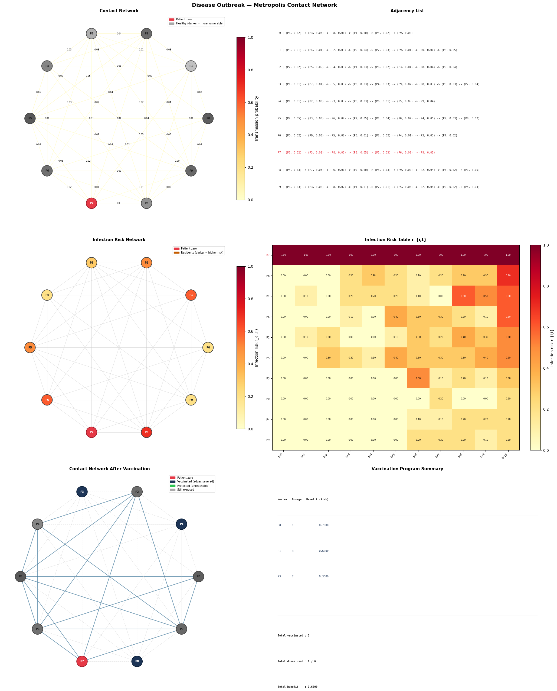

# Modelling a Disease Outbreak

Simulates the spread of an infectious disease through a city's contact network, then decides
who to vaccinate when there aren't enough doses to go round.

The city is a weighted undirected graph: residents are vertices, contact between two people is
an edge, and the edge weight is the daily probability of transmission across that contact. From
that model the program computes each resident's infection risk over a planning horizon, then
allocates a limited antiviral supply to maximise the total risk averted.



## What it does

**Two interchangeable graph representations.** An adjacency matrix and an adjacency list expose
an identical public interface, so the representation is swapped with a single config value
(`graph_type`) and every downstream algorithm keeps working unchanged. The matrix costs
O(|V|²) space and O(|V|) per neighbour lookup; the list costs O(|V| + |E|) space and returns
neighbours in O(deg(v)).

**Exact infection risk by dynamic programming.** The obvious approach is Monte Carlo — run the
outbreak thousands of times and count. That is slow and only approximate. Instead the risk table
is filled column by column using

```
r[i][0] = 1.0 if V_i is patient zero, else 0.0
r[i][t] = 1 - (1 - r[i][t-1]) * Π (1 - r[j][t-1] * w_ij)   for V_j in N(V_i)
```

Each day depends only on the previous day, so one pass over the edge set per day gives exact
probabilities in O(T · |V| · |E|) instead of the Monte Carlo baseline's O(T · X · |V| · |E|),
where X is the simulation count.

**Antiviral allocation as a knapsack.** Each resident has a dosage requirement (a cost) and an
infection risk (a benefit). Choosing who to treat under a fixed dose budget is 0/1 knapsack, so
it is solved with the standard DP table rather than the provided brute-force baseline, which
enumerates all 2ⁿ subsets.

**Empirical analysis.** All four algorithm–representation combinations were timed across sparse
and dense graphs and against a growing time horizon, and the measured curves compared against
the theoretical complexities. Figures in [`visuals/`](visuals/), full write-up in
[`report.pdf`](report.pdf).

| | Sparse graph | Dense graph | Growing T |
|---|---|---|---|
| Figure | `task_c_fig1_sparse.png` | `task_c_fig2_dense.png` | `task_c_fig3_T.png` |

## Running it

Requires **Python 3.10+** (uses `X | None` annotation syntax) and `matplotlib`.

```bash
pip install matplotlib
python simulate_outbreak.py config.json
```

Everything is driven by a JSON config — see [`example_config.json`](example_config.json). The
keys that change what actually runs:

| Key | Options | Effect |
|---|---|---|
| `graph_type` | `"list"` / `"matrix"` | Graph representation |
| `risk_solver` | `"monte_carlo"` / `"task_b"` | Approximate baseline vs exact DP |
| `vaccine_strategy` | `"brute_force"` / `"task_d"` | Exhaustive search vs knapsack DP |
| `seed` | int | Fixed seed, so runs are reproducible |

Reproduce the timing experiments with:

```bash
python run_task_c.py
```

## Provenance

Coursework for **Algorithms and Analysis (COSC2123/3119)** at RMIT University. The assignment
ships a scaffold — the graph ABC, `Vertex`/`Edge`/`Person`/`City`, the Monte Carlo and
brute-force baselines, config validation, the timer and the visualiser — which is RMIT's and is
marked as such in each file header.

My work is:

- `graph/adjacency_matrix.py` — the matrix representation
- `transmission/task_b.py` — the infection-risk DP
- `treatment/task_d.py` — the knapsack allocation DP
- `run_task_c.py` — the timing harness
- `report.pdf` — complexity analysis and empirical discussion

## Limitations

- The transmission model assumes contact probabilities are independent and static; real contact
  networks are neither.
- The knapsack DP is pseudo-polynomial — O(n · W) in the dose budget — so a very large budget
  costs memory that a greedy approximation would not.
- The adjacency matrix is dense-only; it allocates |V|² regardless of edge count, which is
  wasteful for the sparse graphs that real contact networks tend to be.
